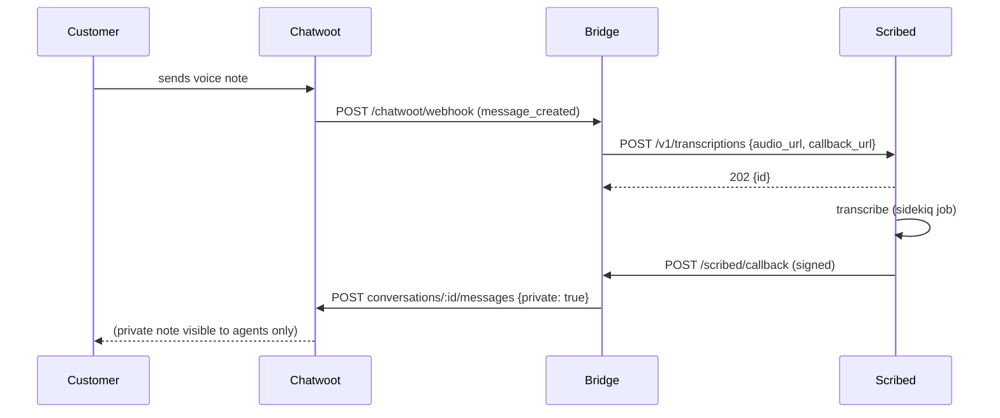

# Chatwoot <-> scribed bridge

A tiny Sinatra app that receives Chatwoot `message_created` webhooks, submits any audio attachments to scribed for transcription, and posts the result back as a private (agent-only) note on the conversation.

## Prerequisites

- Ruby 3.3+ and `bundler`
- ngrok (for exposing the bridge to Chatwoot during local dev)
- A Chatwoot deployment (cloud or self-hosted)
- scribed running locally (`docker compose up` in repo root)

## Setup

1. Start scribed: `docker compose up` (from repo root)
2. Start the bridge: `cd examples/chatwoot_webhook_bridge && bundle install && BRIDGE_PUBLIC_URL=https://YOUR.ngrok.app bundle exec puma -p 4567 config.ru`
3. Expose the bridge to Chatwoot: `ngrok http 4567` and copy the https URL into `BRIDGE_PUBLIC_URL` (restart the bridge after setting)
4. In Chatwoot: Settings -> Integrations -> Webhooks -> Add. URL = `https://YOUR.ngrok.app/chatwoot/webhook`. Events = `message_created`. If you turn on HMAC, copy the secret into `CHATWOOT_HMAC_SECRET`.
5. Generate a Chatwoot user access token: Settings -> Profile -> Access Token. Copy into `CHATWOOT_API_TOKEN`.
6. Have a customer send an audio message via WhatsApp/web widget. The bridge picks it up, scribed transcribes it, the bridge posts a private note on the conversation.

## Required env vars

| Var | Default | What it is |
|---|---|---|
| `CHATWOOT_BASE_URL` | `http://localhost:3000` | Your Chatwoot host (e.g. `https://app.chatwoot.com`) |
| `CHATWOOT_API_TOKEN` | (required) | User access token for the agent that will post replies |
| `CHATWOOT_HMAC_SECRET` | `""` | Optional. If set, the bridge verifies the inbound webhook signature |
| `SCRIBED_URL` | `http://localhost:3000` | scribed REST endpoint |
| `SCRIBED_API_KEY` | `change-me-dev-key` | Bearer token for scribed |
| `SCRIBED_WEBHOOK_SECRET` | `change-me-webhook-secret` | HMAC secret scribed uses on outbound webhooks (must match scribed's `SCRIBED_WEBHOOK_SECRET`) |
| `BRIDGE_PUBLIC_URL` | `http://localhost:4567` | The bridge's externally-reachable URL (ngrok URL in dev) |

## Sequence

## Limitations (demo, not production)

- In-memory correlation map (`@@correlations`) -- lost on restart. Use Redis or a DB in production.
- No retry on the Chatwoot reply POST. If Chatwoot is down at callback time, the transcript is lost.
- Single-process. No Sidekiq, no work queue.
- Chatwoot v3 payload shape assumed. Older versions may nest `attachments` under `message` -- adjust `payload["attachments"]` accordingly.
- Chatwoot's `X-Chatwoot-Signature` is a bare hex digest. scribed's `X-Scribed-Signature` is prefixed `sha256=`. The two verifiers are intentionally different.
